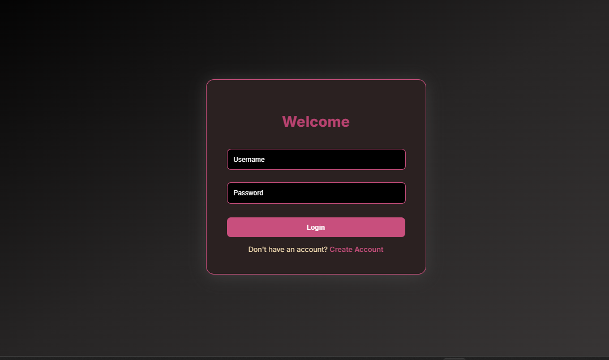
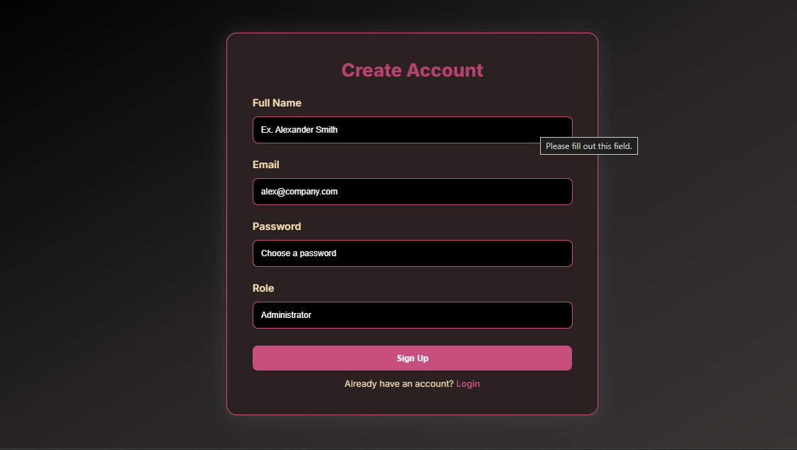
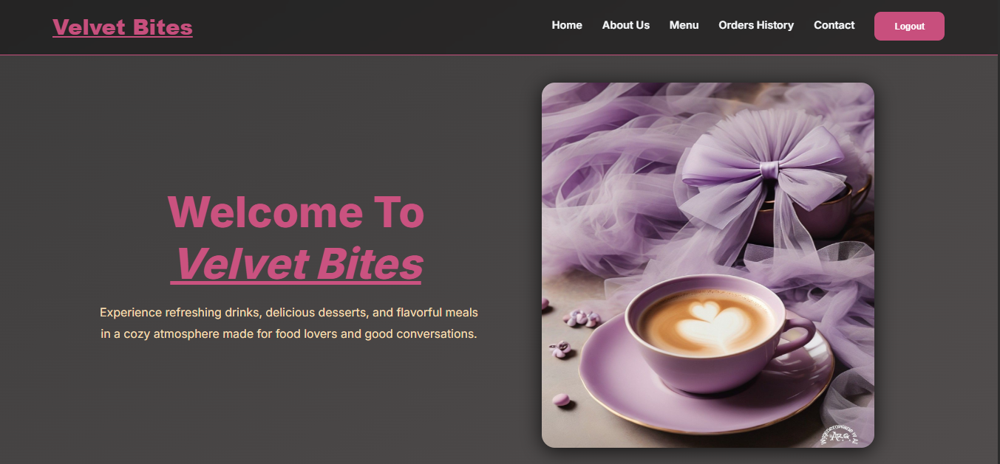
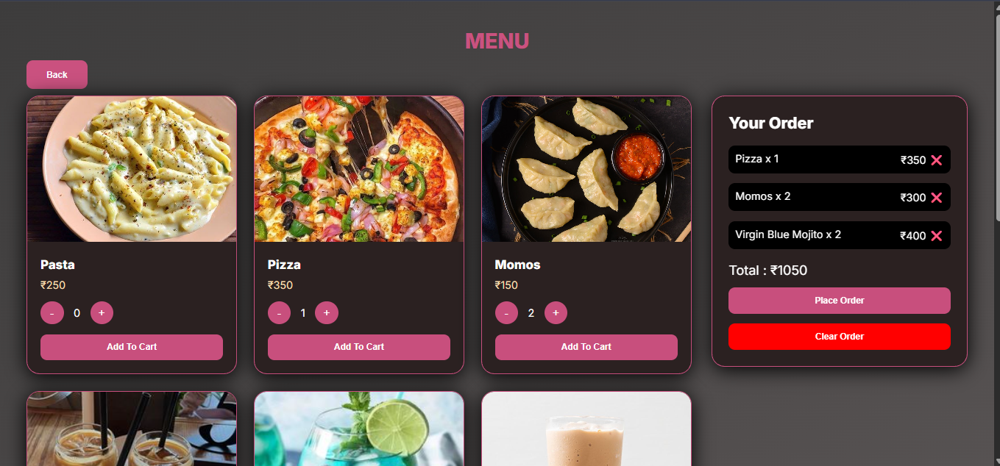
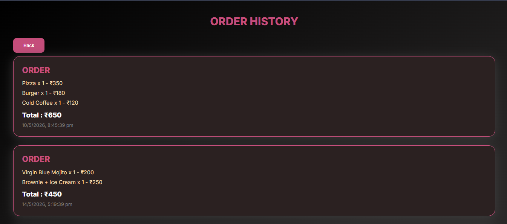

# ☕ Cafe Ordering System (Full Stack Web App)

A full-stack **Cafe Ordering System** built using **Node.js, Express, MongoDB, EJS, HTML, CSS, and JavaScript** with authentication, role-based access (Admin/User), cart system, and order history.

---

## 🚀 Features

### 👤 Authentication System
- User Register & Login
- Password hashing using bcrypt
- Session-based login using express-session

---

### 🔐 Role-Based Access (IMPORTANT)
This project has two different interfaces based on user role:

#### 🧑 User Panel
- Redirected to **User UI (Home)** after login
- Add items to cart
- Increase / decrease quantity
- Remove items from cart
- Place order
- View order history

#### 🛠️ Admin Panel
- Redirected to **Admin Dashboard UI**
- Can view all user orders
- Can monitor all users’ activity/orders
   NOTE: This is under development
 
---

## 🔄 Application Flow

1. User logs in
2. System checks role:
   - `user` → redirected to `/home`
   - `admin` → redirected to `/index`
3. User places order from menu page
4. Order is saved in MongoDB
5. User can view order history anytime

---

## 🧾 Order System
Each order stored in MongoDB contains:
- Username
- Items (name, price, quantity)
- Total price
- Date & time

---

## 🧑‍💻 Tech Stack

- **Frontend:** HTML, CSS, JavaScript, EJS
- **Backend:** Node.js, Express.js
- **Database:** MongoDB
- **Authentication:** bcrypt, express-session

---

## 🔐 Key Highlights

- 🔑 Secure login system using bcrypt
- 👥 Role-based routing (Admin vs User)
- 🛒 Cart system with quantity management
- 📦 Order placement with MongoDB storage
- 📜 Order history tracking per user
- 🧭 Clean navigation between pages

---

## 📸 UI Preview 

### User UI 

### 🖥️ Login & Registration UI

### 🏠 Home Page

### 🍔 Menu Page

* After placing an order, users are redirected to the order history page to view their orders.

### 📦 Order History

