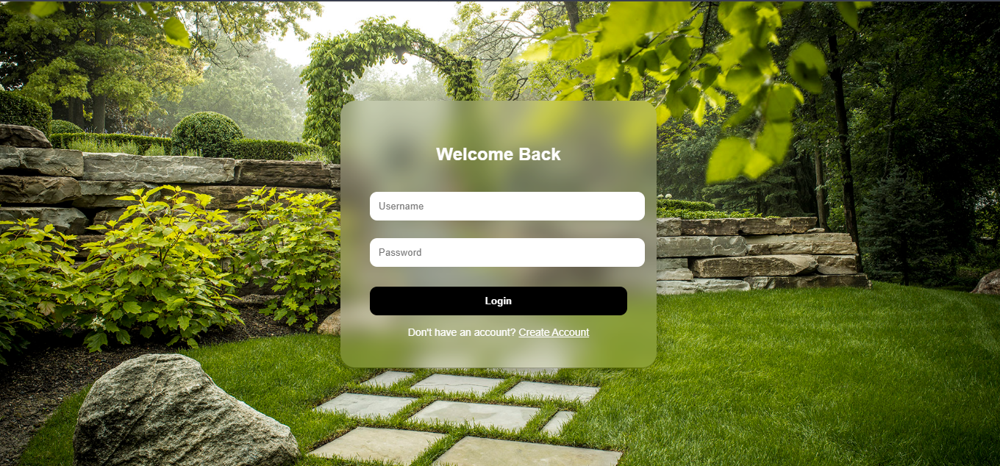
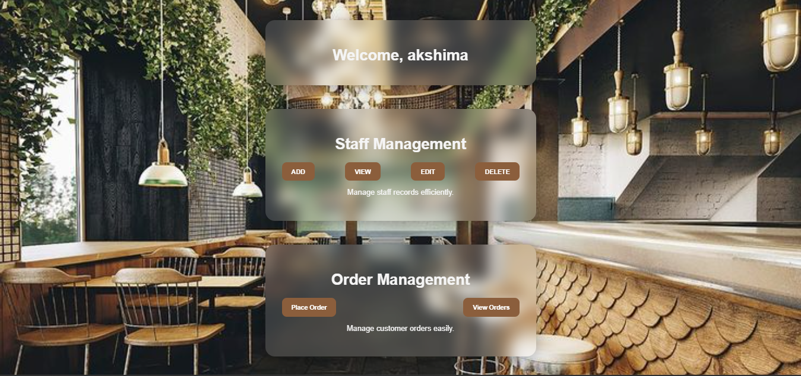
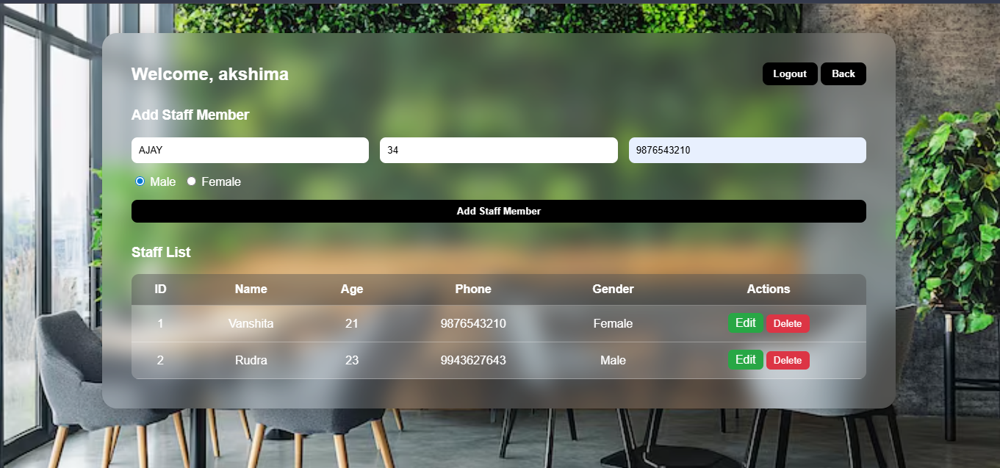
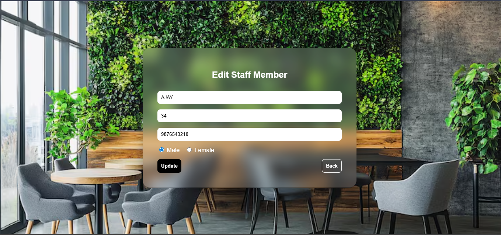
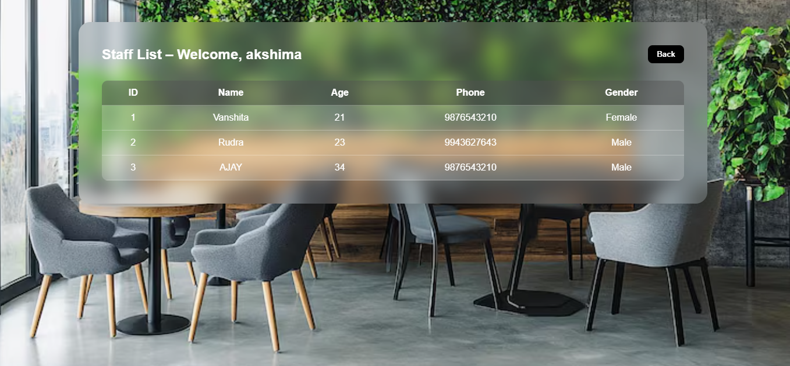
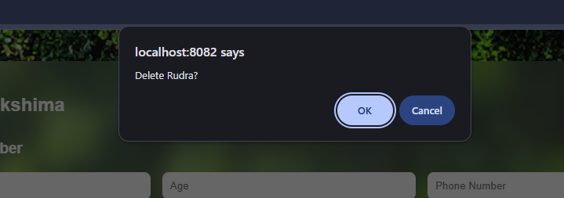
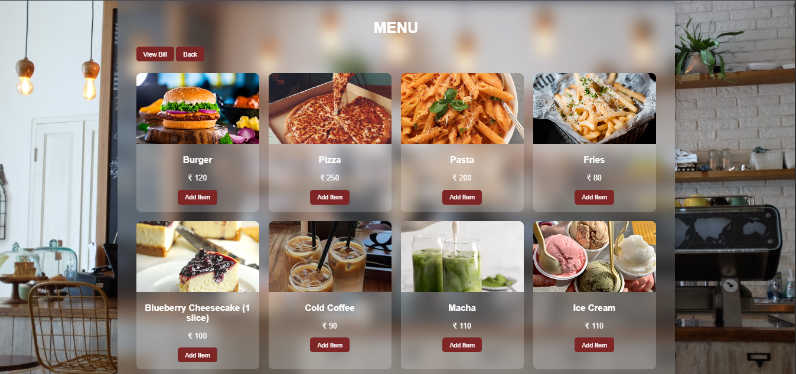
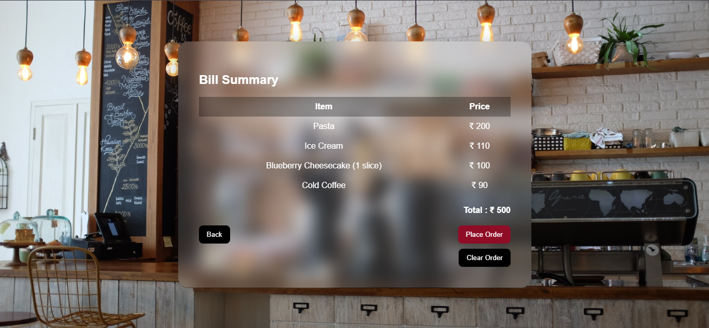
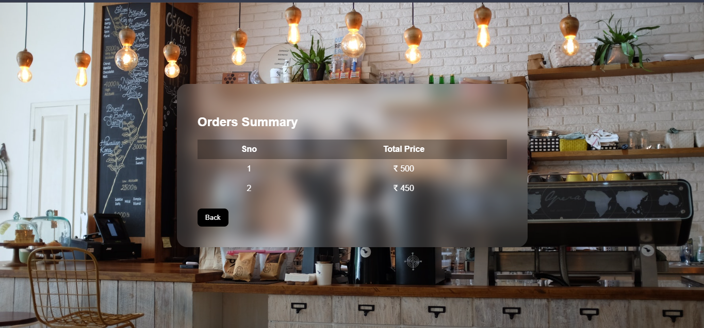

# ☕ Café Management Website

This is a Café Management Web Application built using Node.js and Express.js. It demonstrates key functionalities of a café system, including staff management and order processing.

## 🚀 Features

### 👩‍💼 Staff Management

 ➕ Add new staff members
 ✏️ Edit staff details
 👁️ View staff information
 ❌ Delete staff records

### 🛒 Order Management

 📦 Place orders
 📜 View placed orders

## 🛠️ Technologies Used

* Node.js
* Express.js
* EJS (Templating Engine)
* HTML
* CSS
* JavaScript

## 📂 Project Setup

1. Clone the repository
2. Install dependencies:

   npm install

3. Run the server:

   node index.js

4. Open in browser:

   http://localhost:8082

## 📸 Screenshots

### 🖥️ Login & Registration UI

This interface is used for both user login and registration. The design remains consistent, with only minor text differences between the two functionalities.

### 🏠 Home Page

### 👩‍💼 Staff Management

### ✏️ Edit Staff

### 👁️ View Staff

### ❌ Delete Staff

### 🛒 Place Order

### 🧾 Bill Page

* After placing an order, users are redirected to the vieworders page to view their orders.

### 📜 View Orders

## 📌 Note

This project demonstrates practical implementation of CRUD operations and order handling using Node.js and Express.js.

## 👩‍💻 Author

* Akshima Kakkar
